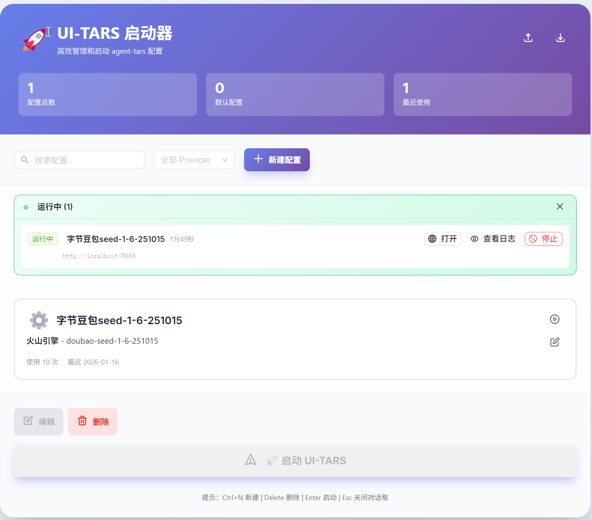

# UI-TARS 启动器

基于 React + Electron + Ant Design 的 agent-tars 配置管理启动器。

## 技术栈

| 技术 | 版本 | 说明 |
|------|------|------|
| React | 18.3 | UI 框架 |
| TypeScript | 5.7 | 类型安全 |
| Electron | 33 | 桌面应用框架 |
| Ant Design | 5.22 | UI 组件库 |
| Zustand | 5.0 | 状态管理 |
| Vite | 6.0 | 构建工具 |

## 功能特性

- **配置管理**: 新建、编辑、删除、复制配置
- **搜索过滤**: 按名称/模型搜索，按 Provider 过滤
- **一键启动**: 命令预览、进程分离启动
- **运行进程管理**: 实时查看运行中的进程、显示运行时长、支持停止进程
- **实时日志查看**: 查看启动日志、自动滚动、日志类型高亮、支持清空日志
- **持久化**: 自动保存、导入/导出 JSON
- **快捷键**: Ctrl+N (新建)、Delete (删除)、Enter (启动)、Esc (关闭)
- **统计**: 配置总数、默认配置、最近使用

## 界面预览



## 目录结构

```
ui-tars-launcher/
├── docs/
│   └── img/             # 图片资源
├── electron/
│   └── main.ts          # Electron 主进程
├── src/
│   ├── components/      # React 组件
│   │   ├── ActionButtons.tsx    # 操作按钮组件
│   │   ├── LogWindow.tsx        # 日志窗口组件
│   │   └── RunningPanel.tsx     # 运行进程面板组件
│   ├── hooks/          # 自定义 Hooks
│   ├── utils/          # 工具函数
│   ├── styles/         # 全局样式
│   │   └── global.css
│   ├── types.ts        # 类型定义
│   ├── store.ts        # Zustand 状态管理
│   ├── App.tsx         # 根组件
│   └── main.tsx        # 入口文件
├── preload.ts          # IPC 预加载脚本
├── package.json
├── vite.config.ts
└── tsconfig.json
```

## 安装依赖

```bash
cd ui-tars-launcher
npm install
```

## 开发模式

```bash
# 同时启动 Vite 开发服务器和 Electron
npm run electron:dev
```

## 构建

```bash
# 构建 React 应用
npm run build

# 打包成 Windows 安装包
npm run dist
```

生成的安装包位于 `release/` 目录。

## 配置文件位置

配置文件保存在:
```
C:\Users\<用户名>\AppData\Roaming\ui-tars-launcher\configs.json
```

## 开发说明

### 添加新组件

1. 在 `src/components/` 创建组件文件
2. 在 `src/App.tsx` 中引入并使用

### 修改 IPC 通信

1. 修改 `electron/main.ts` 添加主进程处理器
2. 修改 `preload.ts` 暴露 API
3. 在 `src/store.ts` 中添加对应方法

## 许可证

MIT
